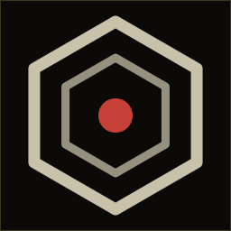

<div align="center">



# Emblem Studio

**Turn any image into an animated, colored ASCII emblem — then export it anywhere.**

`part of the` **[RM3 framework](https://rm3.pro)**

</div>

---

Emblem Studio is a single-purpose, dependency-free authoring tool. Drop in a
logo or photo; it matches the shape as ASCII, lets you tune the look and
animation, and exports a self-contained player you can drop into a terminal,
a web page, a README, or a video.

It runs two ways from the exact same code:

- **As a static site** — open `web/index.html` directly, or serve the `web/`
  folder from any static host (it's pure HTML/JS, no build step, no backend).
- **As a desktop app** — a tiny [Tauri](https://tauri.app) shell (`src-tauri/`)
  hosts the same frontend in a native window.

## Features

- **Match modes:** silhouette or portrait, with adjustable busyness, threshold,
  brightness/contrast, and a library of density-ordered symbol sets.
- **Directional edges:** DoG + Sobel contour glyphs (`/ \ | -`) over the fill.
- **Braille mode:** 2×4 sub-cell rendering with Floyd–Steinberg dithering.
- **Color:** flat, two-tone palette, or sampled-from-image, with a lift control.
- **Animation:** churn, shimmer, dissolve, and a **true 3D card rotation**
  (real perspective foreshortening, mirrored backface, edge-on turn) about the
  Y / X / Z axis — not a fake spin.
- **Motion input:** drive frames from a video, an animated GIF, or your webcam.
- **Themes & presets:** retro palettes, a preset gallery, and URL-safe share
  links that round-trip the full config.
- **Exports:** a self-contained animated `player.html`, animated **GIF**,
  **WebM**, **SVG** (static or self-animating embed snippet), truecolor
  **ANSI** frames, a **PNG**, and a `.zip` bundle.

## Run it

### Static (no install)
```sh
# just open it
xdg-open web/index.html      # or double-click the file

# or serve it
cd web && python3 -m http.server 8080   # then visit http://localhost:8080
```
> The webcam motion source needs a secure context (https:// or localhost) and
> a browser; image / GIF / video upload work anywhere, including `file://`.

### Desktop app (Tauri)
Prerequisites: a [Rust toolchain](https://rustup.rs) and the
[Tauri v2 system dependencies](https://v2.tauri.app/start/prerequisites/) for
your OS, plus the Tauri CLI (`cargo install tauri-cli --version '^2'`).

```sh
cargo tauri dev      # run in a dev window
cargo tauri build    # produce a native installer/binary in src-tauri/target/release
```

Prebuilt binaries for Windows, macOS, and Linux are attached to each
[GitHub Release](../../releases) (built by CI on tagged versions).

## Tests

The engine ships a self-test plus two Node test files (no dependencies):

```sh
cd web
node -e "const E=require('./engine.js');const r=E.selftest();console.log(r.passed+'/'+r.total)"
node gif-encoder.test.js
node motion-input.test.js
```

## Project layout
```
web/            the entire app — static HTML/JS, runnable on its own
  engine.js     DOM-free render/export engine (+ selftest)
  index.html    the UI
  gif-encoder.js, raster.js, motion-input.js, vendor/omggif.js
  assets/       RM3 branding, Share Tech Mono, palette tokens
src-tauri/      Tauri v2 desktop shell (frontendDist -> ../web)
```

## License

Code is licensed under the **Apache License 2.0** — see [`LICENSE`](LICENSE).

The **RM3 name and hexagon emblem are © RM3, all rights reserved** and are
**not** covered by the code license (Apache-2.0 §6). Bundled third-party
components (Share Tech Mono — OFL 1.1; omggif — MIT) are credited in
[`NOTICE`](NOTICE). If you fork and redistribute, please swap the RM3 branding.

— RM3 · [rm3.pro](https://rm3.pro)
